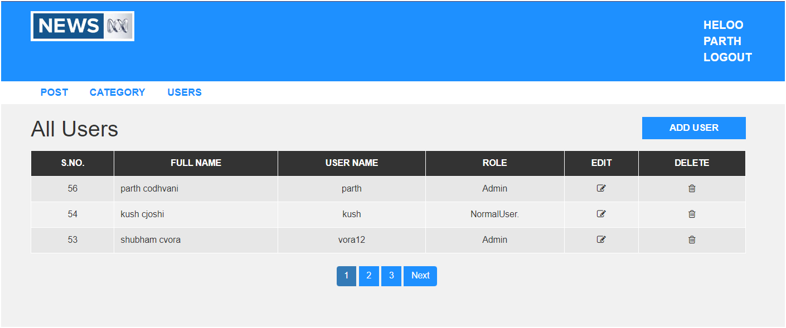

# PHP News App

The PHP News App is a sophisticated web-based platform engineered to streamline news consumption and management. Central to its functionality are user authentication, post categorization, and user management features. Through a secure authentication mechanism, users can seamlessly log in and out, safeguarding their account information. The categorization of news posts facilitates effortless navigation, enabling users to explore content tailored to their interests. Administrators possess exclusive privileges to manage user accounts efficiently, including tasks such as adding, removing, and updating them. This strict control mechanism ensures the integrity and security of the system, with role-based access control distinguishing between administrators and normal users. Normal users are restricted to viewing and contributing news content, while administrators have elevated access for administrative tasks.

Powered by PHP for backend development, the PHP News App offers scalability, flexibility, and reliability. This choice of technology ensures that the platform can accommodate growing user bases and evolving needs without sacrificing performance. In essence, the PHP News App provides users with a user-friendly interface for accessing news content, complemented by robust administrative controls to manage users and uphold system integrity.

## Purpose

- Provide users with a seamless and secure platform for accessing news content.
- Implement user authentication to ensure secure login and logout functionalities.
- Organize news posts into categories for efficient navigation and browsing.
- Empower administrators with exclusive privileges for user management tasks.
- Ensure system integrity and security through strict control mechanisms.
- Leverage PHP for backend development to ensure scalability and reliability.
- Enhance the overall experience of consuming news content for users.

## Technologies Used

1. **IDE: VSCode Editor**
   - Visual Studio Code is a code editor redefined and optimized for building and debugging modern web and git applications.

2. **Programming Language: PHP**
   - PHP is used in backend support and it is easy to use.

3. **JavaScript**
   - JavaScript is a lightweight, interpreted programming language designed for creating network-centric applications.

4. **MVC**
   - MVC (Model-View-Controller) is used to divide the project into small and different parts, improving manageability and scalability.

5. **Ajax**
   - AJAX allows web pages to be updated asynchronously by exchanging data with a web server behind the scenes, enabling parts of a web page to be updated without reloading the whole page.

6. **Database: MySQL**
   - MySQL is a relational database management system based on SQL – Structured Query Language. It is used for a wide range of purposes, including data warehousing, e-commerce, and logging applications. The most common use for MySQL, however, is for the purpose of a web database.

## Features

- **User Authentication**: Secure login and logout functionalities.
- **Post Categorization**: Efficient navigation and browsing through categorized news posts.
- **User Management**: Administrators can add, remove, and update user accounts.
- **Role-Based Access Control**: Differentiates between administrators and normal users to ensure system integrity and security.

## Getting Started

### Prerequisites

- [VSCode Editor](https://code.visualstudio.com/)
- PHP 7.4 or higher
- MySQL 5.7 or higher
- Apache or Nginx web server
- Composer (for PHP dependency management)

### Installation

1. Clone the repository:
   ```bash
   git clone https://github.com/parth0180/news-template.git```
2. Navigate to the project directory:
   ```bash
   cd php-news-app
   ```
3. Install dependencies using Composer:
   ```bash
   composer install
   ```
4. Set up the database:
   - Create a new MySQL database.
   - Import the database schema from `database/schema.sql`.
   - Update the database configuration in `config/database.php`.

5. Start the development server:
   ```bash
   php -S localhost:8000 -t public
   ```

### Usage

- Access the application in your web browser at `http://localhost:8000`.
- Register a new account or log in with an existing account.
- Explore and manage news posts through the user-friendly interface.
- Administrators can manage user accounts and perform administrative tasks from the admin panel.

# Demo 


### Srs image 
<hr />


### Login Page 

<hr /> 



### Admin can view and update all User 
<hr />


### only Admin can add post and update and delete post 
<hr />


### Home page for User 


### Post View 


## Contributing

Contributions are welcome! Please fork the repository and submit a pull request for review.

## License

This project is licensed under the MIT License. See the [LICENSE](LICENSE) file for details.

## Contact

For any inquiries or feedback, please contact [parthodhvani018@gmail.com](mailto:parthodhvani018@gmail.com).

---

Thank you for using the PHP News App! We hope it enhances your news consumption experience.